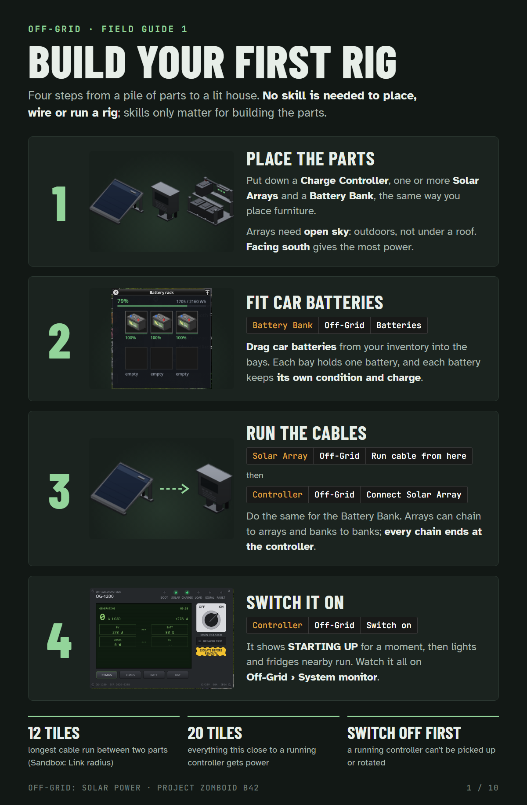

# Off-Grid: Solar Power

Solar power for Project Zomboid Build 42 that behaves like solar power. Panels on the ground or bolted flat to a roof,
a chain of battery racks in a back room, and a charge controller that powers everything around it. Silent, unlike a
generator.

- **Steam Workshop:** https://steamcommunity.com/sharedfiles/filedetails/?id=3789425624
- **How it works:** see the [wiki](https://github.com/turret001/OffGrid/wiki)
- **FAQ:** [short answers to common questions](https://github.com/turret001/OffGrid/wiki/FAQ)
- **Mod ID:** `OffGrid` · **Workshop ID:** `3789425624` · **Version:** 2.10.1 · **Game:** Build 42

## Install

Subscribe on the Steam Workshop and enable **Off-Grid** in the Mods menu. On a server, add `OffGrid` to `Mods=` and
`3789425624` to `WorkshopItems=`, and update the server and every client together.

This repository holds the mod folder exactly as it ships (`OffGrid/`). To run it without Steam, copy that folder into
`%UserProfile%\Zomboid\mods\`.

## Reporting a bug

1. **With Error Magnifier installed:** when an error shows up, open Error Magnifier, go to its Mods tab, pick
   Off-Grid and press Copy. That copies the error plus Off-Grid's own diagnostic report (settings, what the sun model
   is fed, and the state of every Off-Grid part near you).
2. **Without it:** send `%UserProfile%\Zomboid\console.txt` right after the problem happens, before restarting.
   Server owners: the server's console log.
3. Say whether it happened in singleplayer or on a server, and list your other mods.

Post it in the [Bug Reports discussion](https://steamcommunity.com/workshop/filedetails/discussions/3789425624) or open
an issue here.

## Optional mod support

- **Error Magnifier:** Off-Grid adds a diagnostic report to its Mods tab.
- **Water Pipes:** a running sprinkler rinses dust off arrays in its reach, the same way rain does.
- **LG Extended Electricity:** Off-Grid tells it the charge controller is not a petrol generator.
- **Better Generator Info:** the controller is a real generator, so its overlay can include a running one.

## License

[Creative Commons Attribution-NonCommercial-ShareAlike 4.0](LICENSE) (CC BY-NC-SA 4.0). You may share and adapt the
mod for non-commercial use, with credit, under the same license. Please do not reupload it to the Steam Workshop as
your own item.
